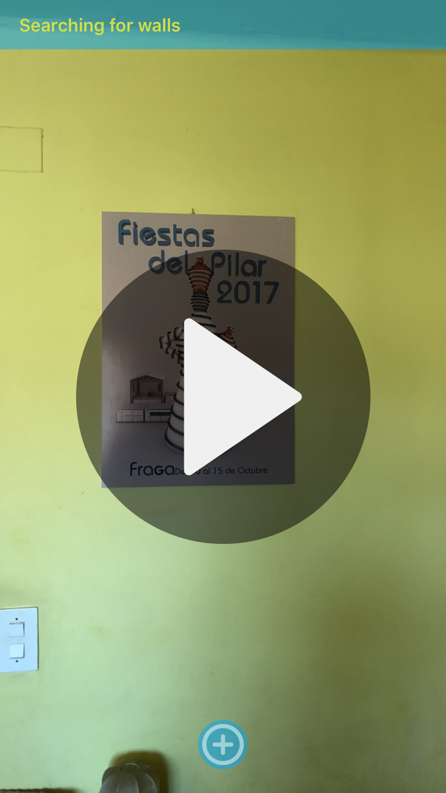

<h1>Is Big Enough</h1>
<h2>IOS (Swift)</h2>
<b>Main tools</b>
<ul>
<li>Scene view</li>
<li>Augmented Reality with ARKit</li>
</ul>

<h1>Description</h1>

Is Big Enough is a AR app that lets you decide which TV size fits better in your wall

The app uses IOS ARKit api to search for walls inside the camera view. Once a wall is detected, the user can place a virtual TV anchored to that wall.
Tv is resizable and can be turned on and off

This app is an academic/personal project which probably ends up being uploaded to the app store

<h1>Screenshots</h1>

  
  

  
  

<h1>Video</h1>

  

<h1>License</h1>

This repo acts like a portfolio and the app contained here <b>can't hold liability neither place warranty</b>. Furthermore, the final porpouse of this app is not decided yet, so in order to avoid problems in the future this repo has a <b>NonCommercial</b> CC-BY-NC license

 This work is licensed under a <a rel="license" href="http://creativecommons.org/licenses/by-nc-nd/4.0/">Creative Commons Attribution-NonCommercial-NoDerivatives 4.0 International License</a>.
